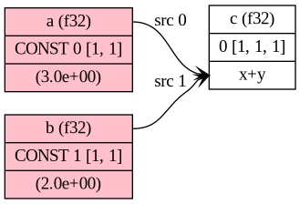

## GGML Exploration Project
The sole purpose of this directory is to explore the GGML C++ library and have
an example that I can use for exploration and understanding.

### Configuration
This project uses a git submodule to include the GGML library. To initialize the
submodule run:
```console
$ git submodule init
```

To update the submodule run:
```console
$ make update-ggml
```

### Building
```console
$ make tensor
```

### Running
The LD_LIBRARY_PATH environment variable must be set to the location of the
GGML library. For example:
```console
$ export LD_LIBRARY_PATH=ggml/build/src
```

```console
$ ./tensor
GGML tensor example
ctx mem size: 16777216
ctx mem used: 0
x tensor type: f32
x tensor backend: 0 
x tensor dimensions: 1
x tensor data: 0x7f0b48022190
x tensor operation: NONE, none
x tensor grad: (nil)
x tensor src: 0x7f0b480220d8
x tensor name: 
x tensor is_param: 0
updated tensor data: 18.000000
updated tensor name: updated
matrix ne[0]: 3
matrix ne[1]: 2
matrix nb[0]: 4
matrix nb[1]: 12
matrix name: 
```

### Graph example
The graph example show a very basic example of creating a computation graph
with two one dimensional tensors and adding them together. The graph for this
looks like this:



In the image above we can see two leafs named "a" and "b", and a node named
"c".
"a" and "b" are constants with the values 3 and 2 respectively. If we look at
the center row of "a"'s output we see:
```
CONST 0 [1, 1]
```
So this is a constant and 0 is the index of this leaf in the graph. The `[1, 1]`
is `ne`, number of elements array where nr[0] is the number of bytes to move to
get to the next element in a row. And nr[1] is the number of bytes to move to
row.


