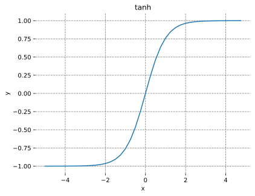
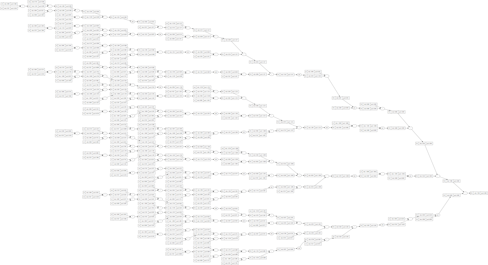
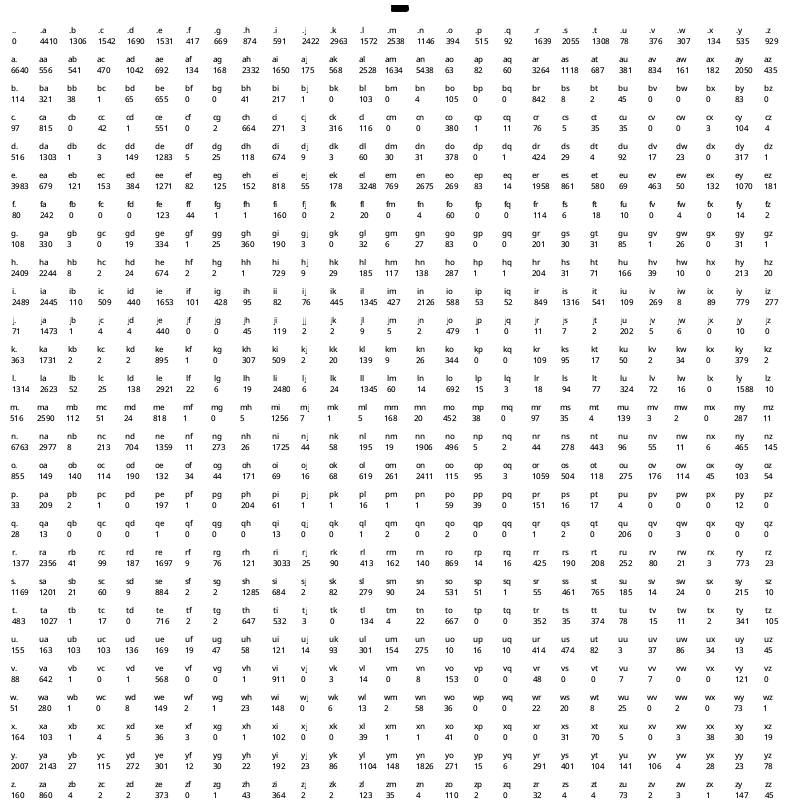

## Neural Networks:  Zero to Hero
This project is a Rust implementation of the youtube series
[Neural Networks:  Zero to Hero] by Andrej Karpathy.
The goal is to implement the code in each video in Rust in a way that allows
the viewer to follow along, but instead of looking at Python code they can
look the Rust code in this repository.

In the series Mr. Karpathy uses some notebook exploration coding which is very
helpful for learning. I'll try to provide the same thing in the code itself, or 
as debugging sessions where applicable.

## Install
This part is not optimal, but to see plots we depend on Python matplolib and
numpy to be available. This is only for plotting, we will be only be using Rust
libraries for everything else, but visualizing the data is an important part
of the learning process so I wanted to provide something and hope to be
replace it with a pure Rust solution in the future.

Create a virtual python environment and install the requirements:
```
$ python3 -m venv zeroh
$ source zeroh/bin/activate
(zeroh) $ pip install -r requirements.txt
```
We also need to install the lapack and openblas development libraries:
```console
$ sudo dnf install lapack-devel openblas-devel
```

### Part1: Building micrograd
The first [part] of the series is called 
`The spelled-out intro to neural networks and backpropagation: building micrograd`.
Since the idea is to follow along with the series, I won't decribe what it does
here which might take away from the learning experience.

The Rust code for this first part of the series can be found in
[part1](./part1/src/main.rs) and can be run with the following command:
```console
(zeroh) $ cargo run -p part1
```
The following plot shows the function the will be used in the  `intro` section:


The first diagram/graph from the `intro` section looks like this:


The second diagram is of the single neuron network before gradients have
been calculated:


Tanh graph for refrence:



After adding the tanh activation function:


After manually calculating the gradients:


Before performing backpropagation using the `backward` function:


After performing backpropagation manually using the explicit `backward` function:


After performing backpropagation using topological order (calling backward)
function:


After performing backpropagation using topological order (calling backward)
function with the "decomposed" tanh function:


Next we have a multi-layer perceptron (MLP) with two hidden layers, each
containing, before backpropagation:


Finally we have a multi-layer perceptron (MLP) with two hidden layers, each
containing, after backpropagation:


And then we have...




### Part2: Building makemore
The second [part] of the series is called 
`The spelled-out intro to language modeling: building makemore`.

This part uses the [tch crate](https://crates.io/crates/tch), so you'll need 
[pytorch](https://pytorch.org/get-started/locally/) and extract it to the
current directory. 
```console
$ wget https://download.pytorch.org/libtorch/cpu/libtorch-cxx11-abi-shared-with-deps-2.0.1%2Bcpu.zip
$ unzip libtorch-cxx11-abi-shared-with-deps-2.0.1+cpu.zip
$ export LIBTORCH=$PWD/libtorch
$ export LD_LIBRARY_PATH=$PWD/libtorch/lib:$LD_LIBRARY_PATH
```
We also need fontconfig-devel for plotters:
```console
$ sudo dnf install fontconfig-devel
```

The Rust code for this part of the series can be found in
[part2](./part2/src/main.rs) and can be run with the following command:
```console
(zeroh) $ cargo run -p part2
```

The first diagram/graph is the count of words distribution:



It's still a work-in-progress!

[Neural Networks:  Zero to Hero]: https://www.youtube.com/playlist?list=PLAqhIrjkxbuWI23v9cThsA9GvCAUhRvKZ
[part1]: https://www.youtube.com/watch?v=VMj-3S1tku0&list=PLAqhIrjkxbuWI23v9cThsA9GvCAUhRvKZ&index=2
